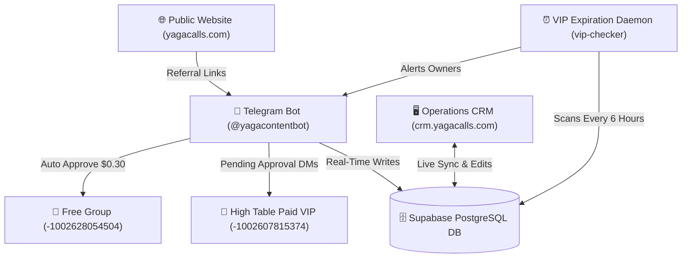

# 🚀 YAGA CALLS ECOSYSTEM — SYSTEM DOCUMENTATION
**Complete Technical & Operational Manual for Telegram Bot, Operations CRM & Supabase Database Engine**

---

## 📖 Executive Summary & Architecture Overview

The **Yaga Calls Operations System** is a unified, automated, 2-tier referral and VIP community management platform. It seamlessly links public traffic from [yagacalls.com](https://yagacalls.com), Telegram Free & Paid Groups, the official Telegram Bot (**`@yagacontentbot`**), and a live web-based **Operations CRM** ([crm.yagacalls.com](https://crm.yagacalls.com)) backed by **Supabase PostgreSQL**.



---

## 1. 🤖 TELEGRAM BOT ENGINE (`@yagacontentbot`)

The bot process (`bot_engine_serverless.js`) runs continuously on the VPS as a PM2 process (`yaga-bot`) using long polling and dual Vercel serverless compatibility.

### 🔑 Key Capabilities:

#### A. Free Group Automatic Join Request Approval
- **Channel ID**: `-1002628054504` (*Yaga Calls Result*)
- **Automated Workflow**:
  1. Detects `chat_join_request` events on the Free Group.
  2. Resolves the invite link hash directly against `public.associates.telegram_invite_link` in PostgreSQL.
  3. Approves the user instantly via Telegram API (`approveChatJoinRequest`).
  4. Logs the new free member to `public.community_members_log` and credits **+$0.30** to the attributed Associate's balance.

#### B. High Table Paid VIP Join Request Routing
- **Channel ID**: `-1002607815374` (*High Table*)
- **Automated Workflow**:
  1. Detects `chat_join_request` events on the High Table group.
  2. **Does NOT auto-approve**. Keeps join request pending until Owner action.
  3. Queries user's historical associate attribution by `telegram_user_id`.
  4. Inserts/updates `public.community_members_log` as `member_tier = 'PAID_VIP_PENDING'`.
  5. Sends an interactive **Telegram DM to System Owners** with 1-tap subscription package selector buttons (`$250`, `$350`, `$700`, `$500`).

#### C. Interactive Owner VIP Enrollment Wizard (`/enroll_vip` or `👑 Enroll VIP Member`)
- **Step 1: Member Name & Handle Input**
  - Accepts text e.g. `@username` or `First Last (@username)`.
  - Preserved strictly across all step transitions via object spreading (`...existingSession`).
- **Step 2: Associate Attribution Selector**
  - Displays inline keyboard with preset Associates (`Jahin Cmc`, `Taju`, `Twitter Jishan`, `Samir`, `Sami`, `jahin twitter`, `Faisal`, `Website`, `Direct`).
- **Step 3: Subscription Package Selector**
  - Options: `$350 (Half-Yearly)`, `$700 (Yearly)`, `$250 (Quarterly)`, `$500 (Custom)`.
- **Step 4: Duration & Custom Start Date Selector**
  - Pre-configured options: `3 Months`, `6 Months`, `8 Months (Promo)`, `12 Months`, `14 Months (Promo)`.
  - **1-Tap Quick Start Date Buttons**:
    - `📍 Today (Aug 8)`
    - `⏪ 1 Mo Ago (Jul 8)`
    - `⏪ 2 Mos Ago (Jun 8)`
    - `⏪ 3 Mos Ago (May 8)`
    - `⏪ 6 Mos Ago (Feb 8)`
  - **Custom Date Parser**: Accepts any custom string e.g. `2026-06-03` or `2026-06-03, 6` or `03/06/2026`.
  - **Timezone-Safe Engine**: Instantiates dates at **12:00 PM Local Noon** to prevent any UTC/GMT timezone rollback shifts.

#### D. Commission Calculation & Confirmation Cards
- Calculates **5% Associate Commission** (`subVal * 0.05`).
- Calculates **25% Kabidul Management Commission** (`subVal * 0.25`).
- Dispatches rich Telegram Markdown confirmation card to Owner:

```text
✅ VIP MEMBER ENROLLED SUCCESSFULLY!

👤 Member: @username
📌 Attributed Associate: Samir
💎 Subscription Package: $350 Tier
⏳ Duration: 8 Months (Promo Offer)
📅 Enrollment Date: Aug 8, 2026
⏰ Expiration Date: Apr 8, 2027
🟢 Status: ACTIVE
🤝 5% Associate Commission: $17.50
💼 Kabidul's 25% Commission: $87.50

⚡️ Synced live to database and CRM VIP Members Desk!
```
- Automatically dispatches Telegram DM to the attributed Associate notifying them of their earned 5% reward!

---

## 2. 💻 OPERATIONS CRM PORTAL (`crm.yagacalls.com`)

The CRM is a modern, responsive React/Vite web application hosted at `crm.yagacalls.com` with secure password authentication (`jahinvin123`).

### 🔑 Core Desks & Features:

#### A. 👑 VIP Members Desk (`VipMembersDeskView.jsx`)
- **Metric Stat Cards**:
  - **Active Subscribers**: Real-time count of active High Table members.
  - **Kabidul's Commission (25%)**: Cumulative 25% management revenue cut ($).
  - **Expiring / Expired**: Count of members expiring within 7 days vs expired.
  - **Total Revenue & 5% Commissions**: Total gross dollar volume and associate payout total.
- **Live Search & Filters**:
  - Instant text search across Member Name, `@handle`, User ID, or Associate Name.
  - Filter by Status (`🟢 Active`, `⚠️ Expiring Soon`, `🔴 Expired`).
  - Filter by Associate or Subscription Package Tier.
- **Live Edit VIP Member Modal**:
  - Allows editing **ANY** member field directly in the CRM:
    1. Member Display Name & Telegram Handle
    2. Telegram User ID
    3. Referred Associate Attribution
    4. Package Tier ($) — *Auto-recalculates 5% and 25% commissions*
    5. Duration (Months)
    6. Joined Date & Expiration Date (Interactive Date Pickers)
    7. Subscription Status (`ACTIVE`, `EXPIRING_SOON`, `EXPIRED`)
    8. 5% Associate & 25% Kabidul Commission Override Fields
- **1-Click Renewal & Deletion Modals**: Instant subscription extension and record deletion.
- **CSV Data Export**: Export full member financial roster to spreadsheet format.

#### B. 👥 Associate Commission Desk (`AssociatesDeskView.jsx`)
- **2-Tier Referral System**:
  - **Tier 1 (Direct)**: Earns 5% on VIP subscriptions and $0.30 per free joiner.
  - **Tier 2 (Parent)**: Earns 2% override on sub-associate VIP subscriptions.
- **Associate Link Management**: Assign, edit, or regenerate unique preset Telegram invite links.
- **Financial Balance Tracking**: Total earnings, paid amounts, and pending payouts.

#### C. 💬 Review Moderation Desk (`ReviewModerationDeskView.jsx`)
- **Customer Testimonials**: Moderate and approve public website reviews.
- **Direct Image Uploads**: Upload proof screenshots to Supabase Storage bucket.
- **Helpful Counter Locking**: Prevent duplicate votes via client IP hashing.

---

## 3. 🗄️ DATABASE SCHEMA & BACKEND DAEMONS

### A. PostgreSQL Database (`public.community_members_log`)

| Column Name | Type | Description |
| :--- | :--- | :--- |
| `id` | `VARCHAR(100)` | Primary Key (e.g. `MEM-1786163351`) |
| `telegram_user_id` | `VARCHAR(100)` | Unique Telegram User ID |
| `first_name` | `TEXT` | Member Display Name |
| `telegram_handle` | `TEXT` | Member Telegram Handle (e.g. `@username`) |
| `associate_id` | `VARCHAR(100)` | Attributed Associate ID |
| `associate_name` | `TEXT` | Associate Display Name |
| `member_tier` | `VARCHAR(50)` | `'PAID_VIP'` \| `'PAID_VIP_PENDING'` \| `'FREE'` |
| `paid_subscription_value` | `NUMERIC(10,2)` | Subscription package price ($) |
| `paid_commission` | `NUMERIC(10,2)` | 5% Associate Commission ($) |
| `kabidul_commission` | `NUMERIC(10,2)` | 25% Kabidul Management Commission ($) |
| `subscription_duration_months`| `INTEGER` | Subscription length (months) |
| `paid_group_joined_at` | `TIMESTAMPTZ` | Enrollment / Start Date |
| `subscription_expiration_date`| `TIMESTAMPTZ` | Calculated Expiration Date |
| `subscription_status` | `VARCHAR(50)` | `'ACTIVE'` \| `'EXPIRING_SOON'` \| `'EXPIRED'` |
| `enrollment_source` | `TEXT` | `'OWNER_BOT_ENROLL'` \| `'OWNER_MANUAL_ENROLL'` |

### B. Automated Background Expiration Daemon (`vip-checker`)
- **File**: `vip_expiration_checker.js`
- **Execution**: PM2 Process 2 running 24/7 on VPS.
- **Schedule**: Scans database every 6 hours.
- **Logic**:
  1. Checks all members where `subscription_expiration_date <= NOW() + 7 days`.
  2. Updates status to `EXPIRING_SOON` (if within 7 days) or `EXPIRED` (if past).
  3. Sends Telegram DMs to System Owners with member details and 1-click renewal inline buttons.

---

## 4. 🛠️ SERVER MANAGEMENT & DEPLOYMENT GUIDE

### VPS Host Information:
- **IP Address**: `104.234.134.236`
- **Root Directory**: `/var/www/yagacontentsystem`
- **GitHub Repository**: [github.com/Afraim3499/yagacontentsystem](https://github.com/Afraim3499/yagacontentsystem)

### PM2 Process Status:
```bash
pm2 status
```
| ID | Process Name | Mode | Status | File |
| :--- | :--- | :--- | :--- | :--- |
| `0` | `yagacalls-web` | fork | online | Next.js Web App |
| `1` | `yaga-bot` | fork | online | `bot_engine_serverless.js` |
| `2` | `vip-checker` | fork | online | `vip_expiration_checker.js` |

### Handy Server Commands:
```bash
# Check Bot Logs
pm2 logs yaga-bot --lines 50

# Restart Bot Process
pm2 restart yaga-bot

# Build & Deploy CRM App
cd /var/www/yagacontentsystem/crm-app && npm run build
```

---

## 🎉 Summary of Achievements

1. **Complete Automated Telegram Workflow**: Zero manual copy-pasting required for free joinees or VIP members.
2. **Instant Live CRM Editing**: Any typo, date error, or status update can be fixed in 2 seconds via the CRM Live Edit Modal.
3. **Accurate Financial Payout System**: Kabidul's 25% management commission and Associate 5%/2% commissions are automatically computed, backfilled, and displayed across all views.
4. **Timezone & Expiration Guard**: Zero date rollback bugs and automated 6-hour daemon checks ensuring expired members are flagged promptly.

*System Documentation generated & verified on August 8, 2026.*
